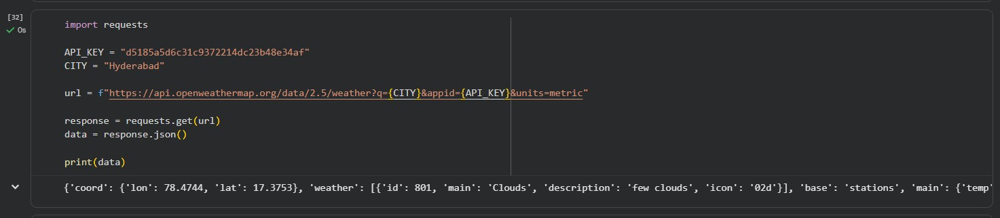
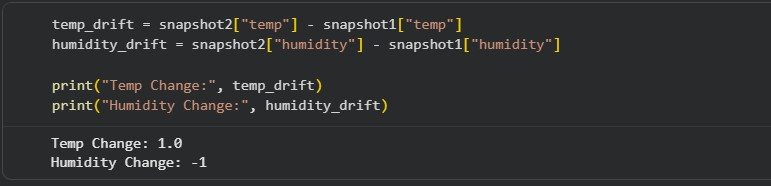
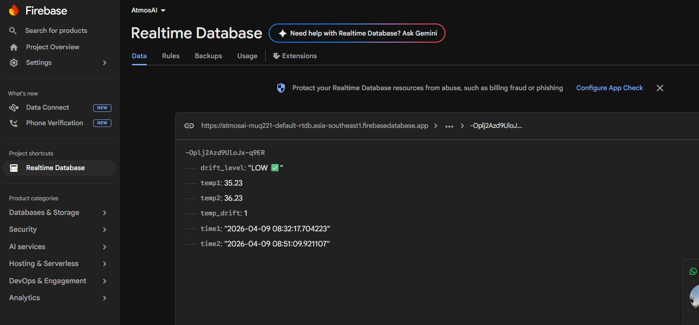

<h1 align="center"> Atmos AI</h1>

  <b><i>Decoding the unseen.</i></b>

  <b>Version 1 — Teaching the system to remember before it predicts.</b>

   Data Engineering • Atmospheric Intelligence • Future AI System

## Overview

Atmos AI is a foundational atmospheric intelligence system that focuses on understanding how environmental data evolves over time.

By capturing real-time data, creating time-based memory snapshots, and computing data drift, the system moves beyond simple data collection to uncover patterns of change. These insights are stored in a cloud-based infrastructure using Firebase, enabling scalability and real-time accessibility.

This version serves as the initial layer of a larger vision — to develop an AI-powered platform capable of predicting atmospheric changes, detecting anomalies, and supporting decision-making in critical sectors such as aviation and weather analytics.

## Features
- Collects real-time data
- Stores past snapshots
- Calculates data drift
- Classifies change levels
- Stores results in Firebase cloud

## Tech Stack
- Python
- Pandas
- Firebase
- API

## Output
The system detects and classifies data changes and stores them in the cloud.

## Future Scope
- Real-time automation
- AI-based prediction
- Web dashboard

## Screenshots

### Data Fetch

### Drift Detection

### Cloud Storage

